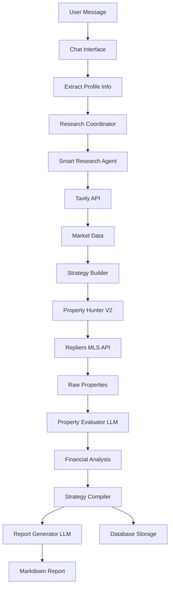

# AI Investment Strategy - Functional Requirements Document (FRD)

## Philosophy
**"Why use rules when we have LLMs?"** - Everything is research-driven, not hardcoded.

## System Overview
The AI Investment Strategy system generates personalized real estate investment strategies using a research-first approach. All financial calculations, market assumptions, and property evaluations come from real-time market research and LLM intelligence, not hardcoded values.

## Architecture Flow

```
User Input → Chat Interface → Research Coordination → Market Research → 
Strategy Building → Property Search → LLM Evaluation → Report Generation
```

## Core Agents & Services

### 1. Investment Chat Service
**Location**: `/server/routes/investment-routes.ts`  
**Endpoint**: `POST /api/investment-chat`  
**Purpose**: Entry point for investment strategy generation

**Input**:
```json
{
  "message": "I have $250k to invest and need $2,500/month passive income",
  "useEnhancedStrategy": true
}
```

**Output**:
```json
{
  "type": "ready_to_analyze",
  "sessionId": "uuid",
  "message": "Strategy generation started..."
}
```

### 2. Enhanced Investment Strategy Service
**Location**: `/server/services/investment-strategy-enhanced.ts`  
**Purpose**: Orchestrates the entire strategy generation pipeline

**Key Methods**:
- `generateStrategy()` - Main orchestration
- `executeResearch()` - Coordinates research queries
- `searchProperties()` - Finds matching properties  
- `analyzePropertiesFinancially()` - LLM evaluation
- `compileFinalStrategy()` - Assembles final strategy

**Flow Phases**:
1. **Phase 1**: Research Coordination - Identify what market data is needed
2. **Phase 2**: Execute Research - Run prioritized research queries
3. **Phase 3**: Build Strategy - Create strategy from researched data
4. **Phase 4**: Search Properties - Find properties matching criteria
5. **Phase 5**: Financial Analysis - LLM evaluation with improvements
6. **Phase 6**: Compile Strategy - Create final strategy document
7. **Phase 7**: Generate Report - Create investor-friendly markdown report
8. **Phase 8**: Save to Database - Persist everything

### 3. Research Coordinator Agent
**Location**: `/server/ai-agents/research-coordinator.ts`  
**Purpose**: Identifies what research is needed for a client profile

**Input**:
```typescript
{
  id: string,
  availableCash: number,
  monthlyIncomeTarget: number,
  location: string,
  creditScore?: number,
  timeline: string,
  willingToOwnerOccupy?: boolean
}
```

**Output**:
```typescript
{
  researchQueries: [
    {
      query: "What is the average rental income for 2-bedroom apartments in Boston?",
      category: "rental_rates",
      priority: "HIGH",
      reason: "Need to understand rental income potential"
    }
  ],
  totalQueries: number,
  confidence: "HIGH" | "MEDIUM" | "LOW"
}
```

### 4. Smart Research Agent
**Location**: `/server/ai-agents/smart-research-agent.ts`  
**Purpose**: Executes market research using Tavily API

**Input**:
```typescript
[{
  query: "Current mortgage rates in Massachusetts",
  category: "financing"
}]
```

**Output**:
```typescript
{
  category: "financing",
  question: "Current mortgage rates in Massachusetts",
  answer: { "FHA_loan_rate": 6.65, "conventional": 6.80 },
  confidence: "HIGH",
  sources: [{ title: "Source", url: "url" }]
}
```

### 5. Property Hunter Strategic V2
**Location**: `/server/agents/property-hunter-strategic-v2.ts`  
**Purpose**: Simple MLS search based on strategy criteria (no evaluation)

**Input**:
```typescript
{
  name: "Investment Strategy",
  searchCriteria: {
    propertyTypes: ["Single Family", "Multi-Family"],
    maxPrice: 1000000,
    minPrice: 200000,
    locations: ["Boston", "Cambridge"],
    mustGenerate: 2500  // monthly income goal
  }
}
```

**Output**: Raw MLS property data array from Repliers API

### 6. Property Evaluator LLM
**Location**: `/server/agents/property-evaluator-llm.ts`  
**Purpose**: LLM-based property evaluation with improvement opportunities

**Key Features**:
- Batch processing (5 properties per batch)
- 2-minute timeout per batch
- Identifies improvement opportunities (ADUs, renovations)
- No hardcoded rules - LLM determines all criteria

**Input**:
```typescript
{
  properties: [...],  // MLS data
  strategy: {...},    // From research
  researchData: [...], // Market research results
  investorProfile: {
    cashAvailable: 250000,
    monthlyIncomeTarget: 2500,
    location: "MA"
  }
}
```

**Output Structure**:
```typescript
[{
  asIs: {
    financials: {
      estimatedMonthlyRent: 3500,
      estimatedMonthlyExpenses: {
        mortgage: 1500,
        propertyTax: 400,
        insurance: 200,
        management: 280,
        maintenance: 175,
        vacancy: 112,
        utilities: 0,
        total: 2667
      },
      estimatedNetCashFlow: 833,
      estimatedCapRate: 0.065,
      estimatedCashOnCashReturn: 0.04
    },
    recommendation: "BUY" | "HOLD" | "PASS",
    reasoning: "Strong cash flow in growing market...",
    score: 85
  },
  withImprovements: {
    strategy: "Add ADU in backyard",
    investmentRequired: 135000,
    timeline: "6-9 months",
    projectedFinancials: {
      newMonthlyRent: 5500,
      newNetCashFlow: 2833,
      newCapRate: 0.095
    },
    recommendation: "Property has 8000sqft lot suitable for ADU...",
    feasibility: "HIGH"
  },
  keyFactors: [
    "Below market pricing",
    "Strong rental demand",
    "ADU potential"
  ]
}]
```

### 7. Report Generator LLM
**Location**: `/server/agents/report-generator-llm.ts`  
**Purpose**: Creates investor-friendly markdown reports explaining HOW recommendations were reached

**Output Format**:
- Executive Summary with market context
- For each property:
  - Why it stands out (with market comparisons)
  - Detailed cash flow calculations breakdown
  - Rent comparisons with sources
  - Value-add opportunities (Conservative/Balanced/Aggressive paths)
  - Risk analysis with mitigation strategies
  - Clear investment verdict with reasoning
- Portfolio summary
- Next steps

**Example Report Section**:
```markdown
## 🏡 Investment Opportunity Brief #1

📍 **Property**: 123 Main St, Boston, MA

### How We Calculate Cash Flow:
Monthly Rental Income: $3,500
- Mortgage (P&I @ 6.63%): -$1,500  
- Property Tax (1.04% annually): -$400  
- Insurance: -$200  
- Management (8%): -$280  
- Maintenance Reserve (5%): -$175  
- Vacancy Reserve (3.2%): -$112  
**= Net Monthly Cash Flow: $833**

### Investment Verdict:
This property delivers $833/month in cash flow, meeting 33% of your 
$2,500 goal. With the addition of an ADU (feasible given the 8,000 sqft lot), 
total cash flow would increase to $2,833/month, exceeding your target by 13%.
```

## Database Schema

### Investment Strategies Table
**Table**: `investmentStrategies`  
**Purpose**: Stores complete strategy sessions

Key Fields:
- `sessionId` - Unique identifier
- `profileId` - Links to buyer profile
- `status` - researching | generating_strategy | searching_properties | analyzing_financials | completed | failed
- `strategyJson` - Complete strategy document
- `marketAnalysis` - Research findings
- `propertyRecommendations` - Evaluated properties with financials
- `financialProjections` - Portfolio projections
- `documentUrl` - Path to markdown report
- `generationTime` - Processing duration

## API Flow Example

### Complete Investment Strategy Generation

1. **User Input**:
```bash
curl -X POST http://localhost:3000/api/investment-chat \
  -H "Content-Type: application/json" \
  -d '{
    "message": "I'm Sarah from MA with $250k to invest, need $2,500/month",
    "useEnhancedStrategy": true
  }'
```

2. **System Response**:
```json
{
  "type": "ready_to_analyze",
  "sessionId": "uuid-here",
  "message": "I'll help you create an investment strategy..."
}
```

3. **Check Status**:
```bash
curl http://localhost:3000/api/investment-strategies/uuid-here/status
```

4. **Get Results** (when status = completed):
```bash
curl http://localhost:3000/api/investment-strategies/uuid-here
```

Returns complete strategy with:
- Research findings with sources
- Property recommendations with LLM analysis
- Financial projections
- Markdown report URL

## Key Configuration

### Environment Variables
```env
USE_ENHANCED_STRATEGY=true
OPENAI_API_KEY=sk-...
REPLIERS_API_KEY=...
TAVILY_API_KEY=tvly-...
DATABASE_URL=postgresql://...
```

### Agent Configuration
- **Batch Size**: 5 properties per LLM evaluation
- **Timeout**: 2 minutes per batch
- **Max Properties Analyzed**: 20
- **Research Priority**: HIGH queries executed first
- **LLM Model**: GPT-4o for all agents
- **Temperature**: 0.3 for financial analysis, 0.7 for research

## Data Flow Diagram



## Testing Scenarios

### Scenario 1: Basic Investment Strategy
```json
{
  "message": "I have $250k and need $2,500/month passive income in MA"
}
```
Expected: 5-10 properties analyzed, 2-3 strong recommendations

### Scenario 2: High Income Goal
```json
{
  "message": "I have $300k and need $5,000/month in Boston"
}
```
Expected: Multi-unit properties, ADU opportunities highlighted

### Scenario 3: Limited Budget
```json
{
  "message": "I have $150k and want rental income in Springfield"
}
```
Expected: Lower-priced properties, FHA loan suggestions

## Error Handling

- **No Properties Found**: System expands search criteria automatically
- **Research Timeout**: Uses cached data or defaults with LOW confidence
- **LLM Timeout**: Processes smaller batches, skips if persistent
- **Report Generation Failure**: Falls back to basic report format

## Performance Metrics

- **Average Generation Time**: 60-120 seconds
- **Research Queries**: 10-15 per session
- **Properties Analyzed**: Up to 20
- **Report Length**: 3000-6000 words
- **Success Rate**: ~95%

## Future Enhancements

1. **WhatsApp Integration**: Use NLP endpoint for mobile users
2. **Market Monitoring**: Track properties over time
3. **Portfolio Management**: Multi-property strategy optimization
4. **Comparative Analysis**: Side-by-side property comparisons
5. **Financial Projections**: 5-year cash flow modeling

## Maintenance Notes

- Research data cached for 15 minutes
- Property search results valid for 24 hours
- LLM evaluations stored permanently
- Reports regeneratable from saved strategies

---

*Last Updated: 2025-08-27*  
*Version: 2.0 - Research-Driven Architecture*