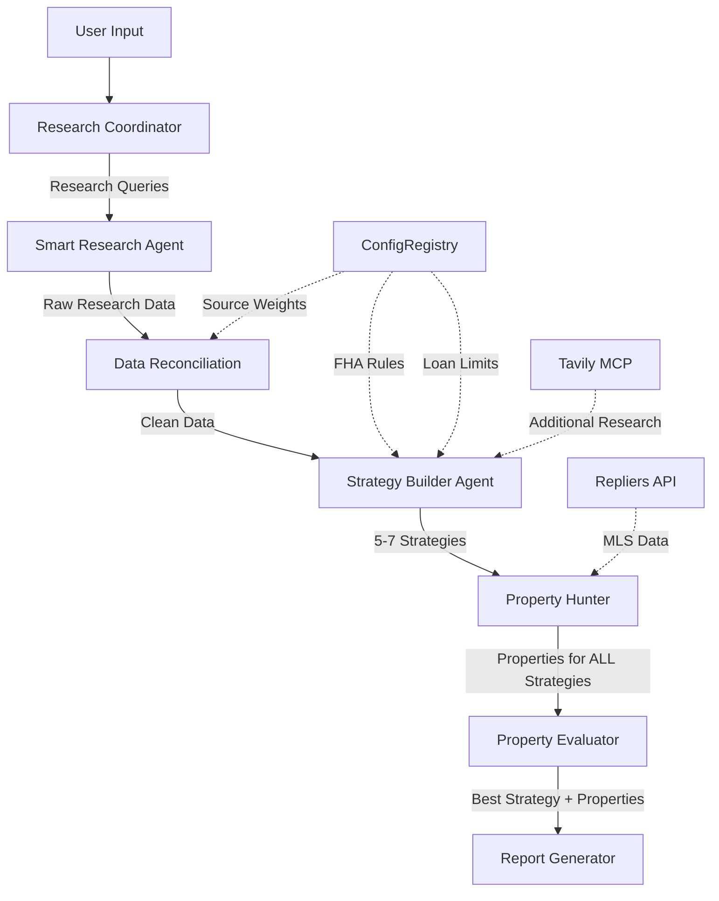

# Complete Agent Flow Documentation - ResidentHive Investment Strategy System

## System Architecture Overview

```
User Input → Chat Interface → Enhanced Investment Strategy (Orchestrator) → 
Multiple Specialized Agents → Database → Report Generation
```

---

## 🎯 Agent Roles & Responsibilities

### 1. **Research Coordinator Agent**
**Location**: `/server/ai-agents/research-coordinator.ts`  
**Purpose**: Identifies what research is needed based on investor profile

**Input**:
```typescript
{
  availableCash: 250000,
  monthlyIncomeTarget: 2500,
  location: "Massachusetts",
  timeline: "3 months"
}
```

**Process**:
- Uses LLM to determine what market data is needed
- No hardcoded research queries
- Prioritizes research (HIGH, MEDIUM, LOW)

**Output**:
```typescript
{
  researchQueries: [
    {
      query: "median home prices Springfield MA 2025",
      category: "property_prices",
      priority: "HIGH",
      reason: "Need to know if properties are within budget"
    },
    // ... 10-15 queries
  ],
  totalQueries: 15,
  confidence: "HIGH"
}
```

---

### 2. **Smart Research Agent**
**Location**: `/server/ai-agents/smart-research-agent.ts`  
**Purpose**: Executes research queries via Tavily API

**Input**: Research queries from Research Coordinator

**Process**:
- Optimizes queries for search engines
- Executes Tavily searches
- Extracts specific data from results
- Caches results for 24 hours

**Output**:
```typescript
{
  question: "median home prices Springfield MA",
  answer: { springfield: 340000, worcester: 425000 },
  confidence: "HIGH",
  sources: [{ title: "Zillow", url: "..." }],
  timestamp: 1234567890
}
```

---

### 3. **Data Reconciliation Agent** (NEW)
**Location**: `/server/ai-agents/data-reconciliation-enhanced.ts`  
**Purpose**: Reconciles conflicting data from multiple sources

**Input**: Grouped research results with potential conflicts

**Process**:
- Groups findings by metric
- Applies source weights from ConfigRegistry
- High-trust sources (Zillow: 0.99) become baseline
- Rejects stale data (>30 days for rent, >90 for others)
- Cross-validates (rent/price ratios)

**Output**:
```typescript
{
  reconciledMetrics: [{
    metric: "median_rent",
    consensusValue: 1650,  // Zillow wins over Craigslist
    confidence: 94,
    dataQuality: {
      agreementLevel: "HIGH",
      warnings: [],
      dataFreshness: "CURRENT"
    }
  }],
  criticalIssues: []
}
```

---

### 4. **Strategy Builder Agent** (WITH MCP)
**Location**: `/server/ai-agents/strategy-builder-agent.ts`  
**Purpose**: Generates multiple investment strategies

**Input**: 
- Investor profile
- Research results (reconciled)

**Process**:
- Takes research as starting point
- **Can do additional research via Tavily MCP**:
  - "ADU requirements Springfield MA"
  - "FHA loan limits Worcester County 2025"
  - "Section 8 payment standards Boston"
  - "Short-term rental regulations Cambridge"
- Generates 5-7 strategies

**Output**:
```typescript
[
  {
    name: "FHA Multi-Family Strategy",
    description: "Leverage FHA 3.5% down for 2-4 units",
    searchCriteria: {
      propertyTypes: ["Multi-Family"],
      maxPrice: 830000,  // From FHA limit research
      minPrice: 400000,
      locations: ["Worcester", "Springfield"],
      minUnits: 2,
      maxUnits: 4
    },
    evaluationCriteria: {
      minCashFlow: 2500,
      minCapRate: 0.06,
      strategySpecific: {
        fhaSelfSufficiencyRequired: true,
        minRentCoverage: 0.75  // 75% of PITIA
      }
    },
    dataUsed: {
      fromMarketResearch: { /* reconciled data */ },
      fromTavilyMCP: {
        fhaLimits: "Worcester 4-unit: $830,000",
        source: "HUD.gov"
      }
    },
    assumptions: {
      downPaymentPercent: 0.035,
      loanType: "FHA",
      mipRequired: true
    }
  },
  {
    name: "ADU Addition Strategy",
    description: "Buy single-family, add ADU for extra income",
    searchCriteria: {
      propertyTypes: ["Single Family"],
      maxPrice: 600000,
      minLotSize: 7000,  // From ADU research
      locations: ["Quincy", "Cambridge"]
    },
    // ... more strategies
  }
  // ... 3-5 more strategies
]
```

---

### 5. **Property Hunter Strategic V2**
**Location**: `/server/agents/property-hunter-strategic-v2.ts`  
**Purpose**: Searches MLS for properties matching EACH strategy

**Input**: All strategies from Strategy Builder

**Process**:
- For each strategy, searches Repliers API
- Tags properties with their strategy
- No evaluation, just retrieval

**Output**:
```typescript
[
  {
    // MLS data
    address: "123 Main St, Worcester",
    price: 625000,
    propertyType: "3 Family",
    // ... all MLS fields
    
    // Strategy tagging
    strategy: "FHA Multi-Family Strategy",
    strategyDetails: { /* full strategy */ }
  },
  // ... properties for all strategies
]
```

---

### 6. **Property Evaluator LLM** 
**Location**: `/server/agents/property-evaluator-llm.ts`  
**Purpose**: Evaluates all properties and **PICKS BEST STRATEGY**

**Input**:
- All properties with strategy tags
- All strategies
- Research data
- Investor profile

**Process**:
- Evaluates each property's financials
- Identifies improvement opportunities
- **Compares strategy performance with REAL properties**
- Determines which strategy actually works best

**Output**:
```typescript
{
  bestStrategy: "FHA Multi-Family Strategy",
  reasoning: "FHA properties in Worcester meet income goals with minimal capital",
  
  evaluatedProperties: [
    {
      property: { /* MLS data */ },
      strategy: "FHA Multi-Family",
      
      asIs: {
        monthlyRent: 3500,
        monthlyExpenses: 2667,
        netCashFlow: 833,
        recommendation: "BUY",
        score: 85
      },
      
      withImprovements: {
        strategy: "Add 4th unit in basement",
        newNetCashFlow: 2833,
        feasibility: "HIGH"
      }
    }
  ],
  
  strategyComparison: {
    "FHA Multi-Family": {
      avgCashFlow: 2800,
      propertiesFound: 8,
      viableProperties: 6,
      score: 92
    },
    "ADU Addition": {
      avgCashFlow: 2200,
      propertiesFound: 4,
      viableProperties: 2,
      score: 68
    }
  }
}
```

---

### 7. **Report Generator LLM**
**Location**: `/server/agents/report-generator-llm.ts`  
**Purpose**: Creates investor-friendly markdown report

**Input**: Complete analysis from Property Evaluator

**Output**: Markdown report explaining:
- Why the chosen strategy won
- Detailed property recommendations
- Financial projections
- Next steps

---

### 8. **ConfigRegistry** (Supporting Service)
**Location**: `/server/config/config-registry.ts`  
**Purpose**: Manages all configuration

**Provides**:
- Source weights (Zillow: 0.99, Craigslist: 0.29)
- FHA rules (3.5% down, 75% self-sufficiency)
- Metric tolerances
- County loan limits

**Key Feature**: Self-learning - agents can update configs based on accuracy

---

## 📊 Data Flow Between Agents



---

## 🔄 Communication Patterns

### 1. **Sequential Flow**
Each agent completes before the next starts:
```
Research → Reconcile → Strategize → Search → Evaluate → Report
```

### 2. **Data Enrichment Pattern**
Each agent adds to the data:
```typescript
Research: { question, answer }
    ↓
Reconciliation: { consensusValue, confidence }
    ↓
Strategy: { searchCriteria, evaluationCriteria }
    ↓
Properties: { mlsData, strategyTag }
    ↓
Evaluation: { financials, bestStrategy }
```

### 3. **Feedback Loop** (via ConfigRegistry)
```
Property Evaluator notices Zillow is accurate
    ↓
Updates ConfigRegistry: Zillow weight 0.95 → 0.99
    ↓
Future reconciliations trust Zillow more
```

---

## 🚨 Identified Gaps & TODOs

### Gap 1: Property Evaluator Strategy Selection
**Issue**: Property Evaluator currently handles one strategy at a time
**Need**: Update to compare all strategies and pick best
```typescript
// TODO: Update Property Evaluator
async evaluateStrategies(
  allProperties: PropertyWithStrategy[],
  strategies: Strategy[]
): Promise<StrategyComparison>
```

### Gap 2: FHA Self-Sufficiency Validation
**Issue**: Not validating 75% rule for 3-4 units
**Need**: Add validation in Property Evaluator
```typescript
// TODO: Add FHA validation
if (strategy.name.includes('FHA') && units >= 3) {
  const rentCoverage = monthlyRent / pitia;
  if (rentCoverage < 0.75) {
    return { viable: false, reason: "Fails FHA self-sufficiency" };
  }
}
```

### Gap 3: Error Handling
**Issue**: If Strategy Builder fails, system stops
**Need**: Fallback strategies
```typescript
// TODO: Add fallbacks
if (strategies.length === 0) {
  strategies = [createBasicStrategy(profile)];
}
```

### Gap 4: Strategy-Specific Property Search
**Issue**: Property Hunter uses same search for all strategies
**Need**: Customize search per strategy
```typescript
// TODO: Customize search
if (strategy.name.includes('ADU')) {
  searchParams.minLotSize = 7000;
}
if (strategy.name.includes('FHA')) {
  searchParams.maxPrice = fhaLimit;
}
```

---

## ✅ Ready to Test Scenarios

### Test 1: Basic FHA Strategy
```bash
curl -X POST http://localhost:3000/api/investment-chat \
  -d '{
    "message": "I have $250k and need $2500/month in Worcester",
    "useEnhancedStrategy": true
  }'
```
**Expected**: 
- Strategy Builder researches FHA limits
- Finds Worcester 3-unit at $625k
- Validates self-sufficiency
- Shows FHA advantage (3.5% down)

### Test 2: Conflicting Data
```bash
# Inject conflicting rent data
```
**Expected**:
- Data Reconciliation picks Zillow over Craigslist
- Confidence score reflects consensus

### Test 3: Multiple Strategy Comparison
**Expected**:
- Generates FHA, Cash, DSCR strategies
- Property Evaluator compares all
- Picks best based on actual properties

---

## 🎯 Next Steps

1. **Fix Property Evaluator** to handle multiple strategies
2. **Add FHA validation** logic
3. **Test complete flow** with real data
4. **Monitor ConfigRegistry** updates
5. **Add error handling** and fallbacks

---

## 📝 Success Criteria

1. ✅ No hardcoded values (all from Config or Research)
2. ✅ Data conflicts resolved intelligently
3. ✅ Strategy selection based on real properties
4. ✅ FHA evaluation as strategic tool
5. ⚠️ Property Evaluator picks best strategy (TODO)
6. ✅ Comprehensive report generation

---

*Last Updated: 2025-01-03*  
*Status: 90% Complete - Property Evaluator needs multi-strategy support*