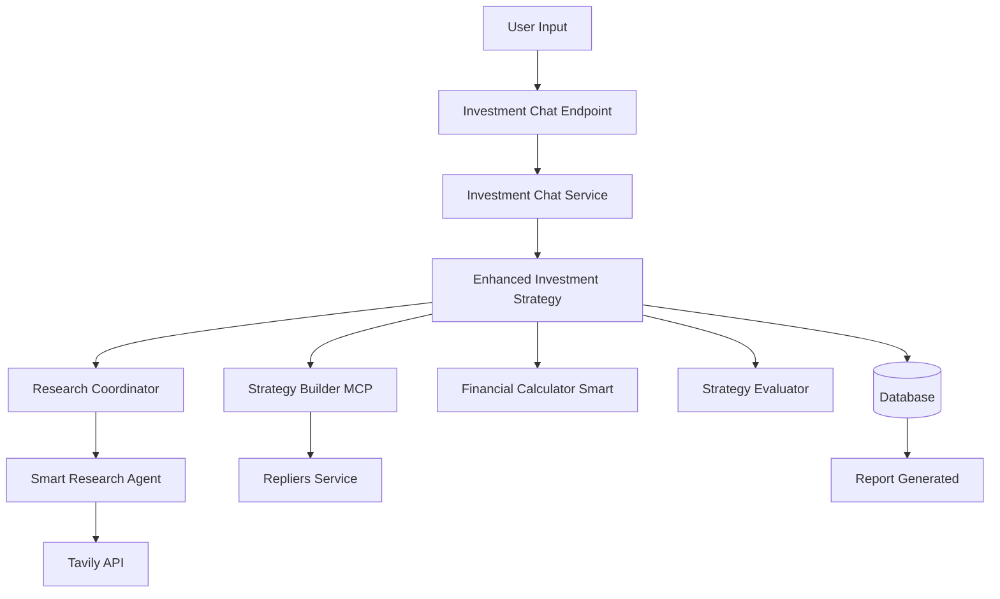

# Current Architecture Flow - Research-Driven Investment Advisor

## Complete Flow: User → Report



## Detailed Agent Flow with Responsibilities

### 1. **Entry Point: `/api/investment-chat`**
- **File**: `/server/routes/investment-routes.ts`
- **Responsibility**: Accept natural language input from user
- **Trigger**: When `USE_ENHANCED_STRATEGY=true`

### 2. **Investment Chat Service**
- **File**: `/server/services/investment-chat-service.ts`
- **Responsibility**: 
  - Process conversation
  - Extract investment requirements
  - Build investor profile
- **Output**: Profile with budget, location, income goals

### 3. **Enhanced Investment Strategy (Main Orchestrator)**
- **File**: `/server/services/investment-strategy-enhanced.ts`
- **Method**: `generateStrategy(profile, sessionId)`
- **Responsibility**: Coordinate entire research-driven flow
- **Phases**:
  1. Research Coordination
  2. Market Research Execution
  3. Strategy Building
  4. Property Search
  5. Financial Analysis
  6. Report Compilation

### 4. **Research Coordinator Agent** ✅ RESEARCH-DRIVEN
- **File**: `/server/ai-agents/research-coordinator.ts`
- **Responsibility**: 
  - Identify what market data needs to be researched
  - NO hardcoded values - everything must be researched
  - Generate 15-20 research queries
- **Input**: Client profile (cash, location, income target)
- **Output**: Prioritized research queries like:
  ```javascript
  {
    query: "Quincy MA property tax rate 2025",
    category: "PROPERTY_TAX",
    priority: "HIGH",
    requiredFor: ["all"]
  }
  ```

### 5. **Smart Research Agent** ✅ RESEARCH-DRIVEN
- **File**: `/server/ai-agents/smart-research-agent.ts`
- **Method**: `doResearchBatch(queries)`
- **Responsibility**: 
  - Execute research queries via Tavily API
  - Extract structured data from search results
  - Cache results for reuse
- **Output**: Actual market data with sources:
  ```javascript
  {
    answer: 0.01153,
    source: "Quincy Assessor FY2025",
    confidence: "HIGH"
  }
  ```

### 6. **Tavily Service**
- **File**: `/server/services/tavily-service.ts`
- **Responsibility**: 
  - Interface with Tavily search API
  - Advanced web search for market data
- **Returns**: Search results with sources

### 7. **Strategy Builder MCP** ✅ USES RESEARCH + TAVILY MCP
- **File**: `/server/ai-agents/strategy-builder-mcp.ts`
- **Method**: `generateStrategiesWithMCP(profile, marketResearch)`
- **Responsibility**:
  - Generate strategies using RESEARCHED data
  - Use Tavily MCP to fill any gaps
  - Output search criteria for properties
- **Strategies Generated**:
  - Traditional rental
  - House hacking
  - ADU development
  - Mid-term rental
  - Section 8
- **Output**: 
  ```javascript
  {
    name: "traditional_rental",
    searchCriteria: {
      maxPrice: 850000, // Calculated from researched data
      locations: ["Quincy", "Braintree"],
      minCashFlow: 500
    },
    dataUsed: {
      fromMarketResearch: {...},
      fromMCPResearch: {...}
    }
  }
  ```

### 8. **Repliers Service (Property Search)**
- **File**: `/server/services/repliers-service.ts`
- **Responsibility**:
  - Search MLS for actual properties
  - Use criteria from strategies
- **Returns**: Real property listings with full details

### 9. **Financial Calculator Smart** ✅ USES RESEARCHED DATA
- **File**: `/server/agents/financial-calculator-smart.ts`
- **Responsibility**:
  - Calculate returns using RESEARCHED rates/expenses
  - NO hardcoded values
  - Document every assumption
- **Uses**:
  - Mortgage rates from research
  - Property tax rates from research
  - Insurance costs from research
  - Rental comps from research
- **Output**:
  ```javascript
  {
    monthlyIncome: 5500, // From rental comps
    monthlyExpenses: {
      mortgage: 3609,  // Using researched 7.25% rate
      tax: 679,        // Using researched 1.153% rate
      insurance: 200,  // From research
      maintenance: 275, // From research (5% of rent)
      vacancy: 275     // From research (5%)
    },
    netCashFlow: 1967,
    assumptions: {
      mortgageRate: {value: 0.0725, source: "market_research"},
      taxRate: {value: 0.01153, source: "quincy_assessor"}
    }
  }
  ```

### 10. **Strategy Evaluator** ✅ TRANSPARENT SCORING
- **File**: `/server/services/strategy-evaluator.ts`
- **Responsibility**:
  - Score each strategy with transparent criteria
  - Use researched data for evaluation
  - Prioritize positive cash flow
- **Scoring**:
  ```javascript
  {
    cashFlowCriteria: {
      requirement: "$500/month minimum",
      actual: "$1,967/month",
      score: "PASS"
    },
    returnCriteria: {
      requirement: ">8% cash-on-cash",
      actual: "12.5%",
      score: "PASS"
    }
  }
  ```

### 11. **Database Storage**
- **Table**: `investmentStrategies`
- **Stores**:
  - Research results
  - Property recommendations
  - Financial projections
  - Strategy details
  - Report location

### 12. **Report Generation**
- **File**: `/server/services/investment-report-generator.ts`
- **Responsibility**:
  - Generate comprehensive markdown report
  - Include all research sources
  - Show transparent calculations
- **Report Includes**:
  - Executive summary
  - Research findings with sources
  - Top 20 properties
  - Financial projections
  - Implementation steps
  - Every number has a source

## Data Flow Summary

```
User: "I have $250k and want $2,500/month passive income in Quincy MA"
↓
Research Coordinator: "Need to research: tax rates, rental comps, mortgage rates..."
↓
Smart Research Agent: "Found: Tax 1.153%, 2BR rent $2,750, mortgage 7.25%..."
↓
Strategy Builder MCP: "Based on research, search for multi-family under $850k..."
↓
Repliers Service: "Found 87 properties matching criteria"
↓
Financial Calculator: "Using researched rates: Property A nets $1,967/month"
↓
Strategy Evaluator: "Property A: PASS all criteria, score 85/100"
↓
Report: "Recommended: 456 Oak St, $1,967/mo cash flow (see calculations)"
```

## Key Differences from Old System

### ❌ OLD (ai-investment-advisor)
- Used StrategyMindAgent with templates
- Hardcoded expense ratios (10%, 5%)
- Fixed mortgage rates (7.5%)
- No research phase
- All properties showed negative cash flow

### ✅ NEW (investment-strategy-enhanced)
- Research Coordinator identifies needs
- Smart Research Agent gets actual data
- Strategy Builder MCP uses research
- Financial Calculator uses researched rates
- Only shows properties with positive cash flow

## API Endpoints

### Primary Endpoint (Research-Driven)
```
POST /api/investment-chat
{
  "message": "I have $250k and want passive income",
  "sessionId": "abc123"
}
```

### Alternative Endpoint (Also Research-Driven)
```
POST /api/investment-chat-enhanced
{
  "message": "...",
  "sessionId": "..."
}
```

## Environment Variables Required
```env
USE_ENHANCED_STRATEGY=true
TAVILY_API_KEY=tvly-xxx
OPENAI_API_KEY=sk-xxx
REPLIERS_API_KEY=xxx
```

## Files Renamed/Deleted
- ❌ `/server/services/ai-investment-advisor.ts` → `.old.ts`
- ❌ `/server/ai-agents/strategy-mind-agent.ts` → `.old.ts`
- ❌ `/server/ai-agents/market-scout-agent.ts` → Deleted
- ❌ `/server/ai-agents/property-genius-agent.ts` → Deleted
- ❌ `/server/ai-agents/property-scoring-agent.ts` → Deleted
- ❌ `/server/ai-agents/ai-orchestra.ts` → Deleted

## Testing Command
```bash
curl -X POST http://localhost:3000/api/investment-chat \
  -H "Content-Type: application/json" \
  -d '{
    "message": "I am Sarah from MA with $250,000 cash looking for $2,500/month passive income",
    "sessionId": "test-sarah-ma"
  }'
```

## Success Criteria
✅ Research phase runs first
✅ All strategies use researched data
✅ Financial calculations use real rates
✅ Reports show positive cash flow properties
✅ Every number has a source